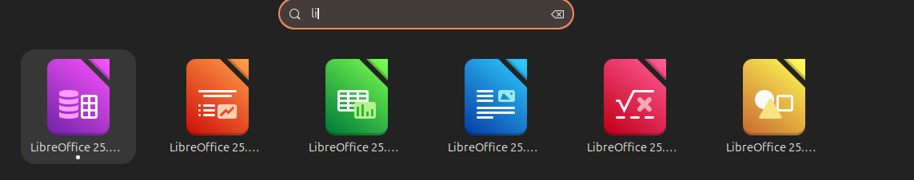

---
## Author
author:
  name: Гусев Степан Андреевич
  degrees: DSc
  orcid: 0000-0002-0877-7063
  email: 1032242444@pfur.ru
  affiliation:
    - name: Российский университет дружбы народов
      country: Российская Федерация
      postal-code: 117198
      city: Москва
      address: ул. Миклухо-Маклая, д. 6

## Title
title: "Отчёт по лабораторной работе №2"
subtitle: "Дисциплина: Архитектура компьютеров и операционные системы"
license: "CC BY"
---

# Цель работы

Изучить идеологию и применение средств контроля версий и научиться работать с системой контроля версий git.

# Задание

1. Настройка GitHub.
2. Базовая настройка Git.
3. Создание SSH-ключа.
4. Создание рабочего пространства и репозитория курса на основе шаблона.
5. Создание репозитория курса на основе шаблона.
6. Настройка каталога курса.
7. Выполнение заданий для самостоятельной работы.

# Теоретическое введение

Системы контроля версий (Version Control System, VCS) применяются при работе нескольких человек над одним проектом. Обычно основное дерево проекта хранится в локальном или удалённом репозитории, к которому настроен доступ для участников проекта. При внесении изменений в содержание проекта система контроля версий позволяет их фиксировать, совмещать изменения, произведённые разными участниками проекта, производить откат к любой более ранней версии проекта, если это требуется. В классических системах контроля версий используется централизованная модель, предполагающая наличие единого репозитория для хранения файлов. Выполнение большинства функций по управлению версиями осуществляется специальным сервером. Участник проекта (пользователь) перед началом работы посредством определённых команд получает нужную ему версию файлов. После внесения изменений пользователь размещает новую версию в хранилище. При этом предыдущие версии не удаляются из центрального хранилища и к ним можно вернуться в любой момент. Сервер может сохранять не полную версию изменённых файлов, а производить так называемую дельта-компрессию — сохранять только изменения между последовательными версиями, что позволяет уменьшить объём хранимых данных. Системы контроля версий поддерживают возможность отслеживания и разрешения конфликтов, которые могут возникнуть при работе нескольких человек над одним файлом. Можно объединить изменения, сделанные разными участниками, вручную выбрать нужную версию, отменить изменения вовсе или заблокировать файлы для изменения. В зависимости от настроек блокировка не позволяет другим пользователям получить рабочую копию или препятствует изменению рабочей копии файла средствами файловой системы ОС, обеспечивая таким образом привилегированный доступ только одному пользователю, работающему с файлом. Системы контроля версий также могут обеспечивать дополнительные, более гибкие функциональные возможности. Например, они могут поддерживать работу с несколькими версиями одного файла, сохраняя общую историю изменений до точки ветвления версий и собственные истории изменений каждой ветви. Обычно доступна информация о том, кто из участников, когда и какие изменения вносил. Обычно такого рода информация хранится в журнале изменений, доступ к которому можно ограничить. В отличие от классических, в распределённых системах контроля версий центральный репозиторий не является обязательным. Среди классических VCS наиболее известны CVS, Subversion, а среди распределённых — Git, Bazaar, Mercurial. Принципы их работы схожи, отличаются они в основном синтаксисом используемых в работе команд.
Система контроля версий Git представляет собой набор программ командной строки. Доступ к ним можно получить из терминала посредством ввода команды git с различными опциями. Благодаря тому, что Git является распределённой системой контроля версий, резервную копию локального хранилища можно сделать простым копированием или архивацией.
Работа пользователя со своей веткой начинается с проверки и получения изменений из центрального репозитория (при этом в локальное дерево до начала этой процедуры не должно было вноситься изменений). Затем можно вносить изменения в локальном дереве и/или ветке. После завершения внесения какого-то изменения в файлы и/или каталоги проекта необходимо разместить их в центральном репозитории.

# Выполнение лабораторной работы

## Настройка GitHub

Создал учётную запись на сайте GitHub ([рис. @fig-001]).

{#fig-001 width=70%}

## Базовая настройка Git

Сделал предварительную конфигурацию git. В терминале ввёл следующие команды, указав свои имя и email. Сделал предварительную конфигурацию git. В терминале ввёл следующие команды, указав свои имя и email. Задал имя master для начальной ветки. Задал параметры autocrlf и safecrlf ([рис. @fig-002]).

{#fig-002 width=70%}

## Создание SSH-ключа

Сгенерировал пару ключей: приватный и открытый ([рис. @fig-003]).

{#fig-003 width=70%}

Скопировал ключ в буфер обмена ([рис. @fig-004]).

{#fig-004 width=70%}

На сайте GitHub в меню settings в разделе SSH and GPG keys добавил только что созданный SSH-ключ ([рис. @fig-005]).

{#fig-005 width=70%}

## Создание рабочего пространства и репозитория курса на основе шаблона

Создал каталог для предмета для предмета “Архитектура компьютера” ([рис. @fig-006]).

{#fig-006 width=70%}

## Создание репозитория курса на основе шаблона

В браузере перешёл на страницу репозитория с шаблоном курса. Далее нажал “Use this template”, чтобы использовать этот шаблон для своего репозитория ([рис. @fig-007]).

{#fig-007 width=70%}

Задал имя репозитория и создал его ([рис. @fig-008]).

{#fig-008 width=70%}

В терминале перешёл в каталог курса ([рис. @fig-009]).

{#fig-009 width=70%}

Клонировал созданный репозиторий ([рис. @fig-010]).

{#fig-010 width=70%}

## Настройка каталога курса

Перешёл в каталог курса ([рис. @fig-011]).

{#fig-011 width=70%}

Создал необходимые каталоги ([рис. @fig-012]).

{#fig-012 width=70%}

Отправил файлы на сервер ([рис. @fig-013])([рис. @fig-014]).

{#fig-013 width=70%}

{#fig-014 width=70%}

Проверил правильность создания иерархии рабочего пространства в локальном репозитории ([рис. @fig-015]).

{#fig-015 width=70%}

Проверил правильность создания иерархии рабочего пространства на странице GitHub ([рис. @fig-016]).

{#fig-016 width=70%}

## Выполнение заданий для самостоятельной работы.

Перешёл с помощью команды cd в каталог labs/lab02/report и создал в нём файл для отчёта по второй лабораторной работе с помощью команды touch. Проверил, что файл создан, с помощью команды ls ([рис. @fig-017]).

{#fig-017 width=70%}

Оформить отчёт я смогу в текстовом редакторе LibreOffice Writer, найдя его в меню приложений ([рис. @fig-018]).

{#fig-018 width=70%}

После открытия редактора, открыл в нем созданный файл и начал работу над отчётом ([рис. @fig-019]).

{#fig-019 width=70%}

C помощью команды cd перешёл в каталог lab01/report и переместил в него отчёт по первой лабораторной работе с помощью команды mv. Проверил, что файл успешно перемещён, с помощью ls ([рис. @fig-020]).

{#fig-020 width=70%}

С помощью команды git add добавил в коммит отчёты по двум лабораторным работам. Сохранил изменения на сервере командой git commit -m “Add existing file”, пояснив добавление файлов ([рис. @fig-021])([рис. @fig-022]).

{#fig-021 width=70%}

Отправил в центральный репозиторий изменения сохранённые изменения командой git push -f origin master ([рис. @fig-022]).

{#fig-022 width=70%}

Проверил на сайте GitHub правильность выполнения заданий. Вижу, что пояснение к совершённым действиям отображается ([рис. @fig-023]).

{#fig-023 width=70%}

При просмотре изменений увидел, что были добавлены файлы с отчётами по лабораторным работам ([рис. @fig-024]).

{#fig-024 width=70%}

Проверил, что отчёты по лабораторным работам находятся в соответствующих каталогах репозитория: отчёт по первой лабораторной в lab01/report ([рис. @fig-025]), по второй – в lab02/report ([рис. @fig-026]).

{#fig-025 width=70%}

{#fig-026 width=70%}

# Выводы

В ходе работы я приобрел практические навыки работы с системой контроля версий GitHub, разобрав следующие команды: clone, add, commit, push. Также изучил идеологию и применение подобных систем.

# Список литературы

1. [Архитектура ЭВМ](https://esystem.rudn.ru/pluginfile.php/1584622/mod_resource/content/1/%D0%9B%D0%B0%D0%B1%D0%BE%D1%80%D0%B0%D1%82%D0%BE%D1%80%D0%BD%D0%B0%D1%8F%20%D1%80%D0%B0%D0%B1%D0%BE%D1%82%D0%B0%20%E2%84%963.pdf)
2. [Git - gitattributes Документация](https://git-scm.com/docs/gitattributes)
