---
## Author
author:
  name: Гусев Степан Андреевич
  degrees: DSc
  orcid: 0000-0002-0877-7063
  email: 1032242444@pfur.ru
  affiliation:
    - name: Российский университет дружбы народов
      country: Российская Федерация
      postal-code: 117198
      city: Москва
      address: ул. Миклухо-Маклая, д. 6

## Title
title: "Отчёт по лабораторной работе №3"
subtitle: "Дисциплина: Архитектура компьютеров и операционные системы"
license: "CC BY"
---

# Цель работы

Научиться оформлять отчёты с помощью языка разметки Markdown.

# Задание

1. Заполнение отчета по выполнению лабораторной работы №3 с помощью языка разметки Markdown
2. Задание для самостоятельной работы

# Теоретическое введение

Markdown - легковесный язык разметки, созданный с целью обозначения форматирования в простом тексте, с максимальным сохранением его читаемости человеком, и пригодный для машинного преобразования в языки для продвинутых публикаций. 
Внутритекстовые формулы делаются аналогично формулам LaTeX.
В Markdown вставить изображение в документ можно с помощью непосредственного указания адреса изображения.
Синтаксис Markdown для встроенной ссылки состоит из части [link text], представляющей текст гиперссылки, и части (file-name.md) – URL-адреса или имени файла, на который дается ссылка.
Markdown поддерживает как встраивание фрагментов кода в предложение, так и их размещение между предложениями в виде отдельных огражденных блоков. Огражденные блоки кода — это простой способ выделить синтаксис для фрагментов кода.

# Выполнение лабораторной работы

##  Заполнение отчета по выполнению лабораторной работы №3 с помощью языка разметки Markdown

Открыл терминал и перешёл в каталог курса ([рис. @fig-001]).

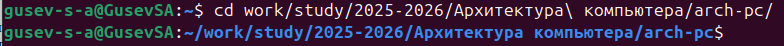{#fig-001 width=70%}

Обновил локальный репозиторий, скачав изменения из удалённого репозитория с помощью команды git pull ([рис. @fig-002]).

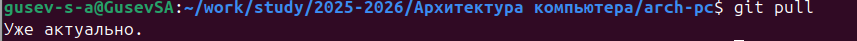{#fig-002 width=70%}

Перешёл в каталог с шаблоном отчёта по лабораторной работе №3 ([рис. @fig-003]).

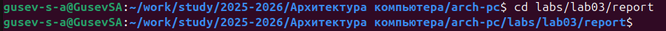{#fig-003 width=70%}

Скомпилировал шаблон с использованим Makefile, введя команду make ([рис. @fig-004]).

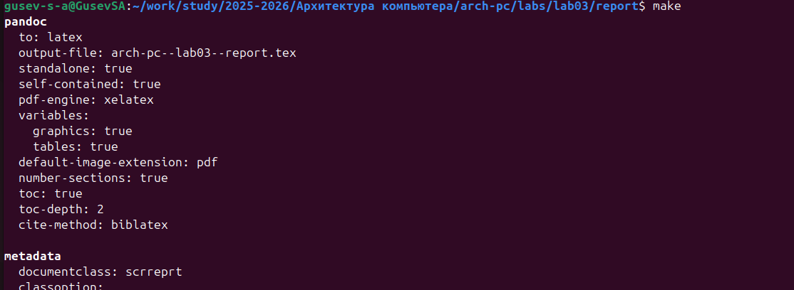{#fig-004 width=70%}

Проверил, что файлы созданы ([рис. @fig-005]).

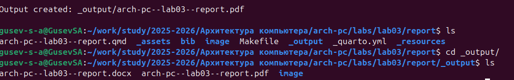{#fig-005 width=70%}

Открыл сгенерированный файл .docx в LibreOffice ([рис. @fig-006]).

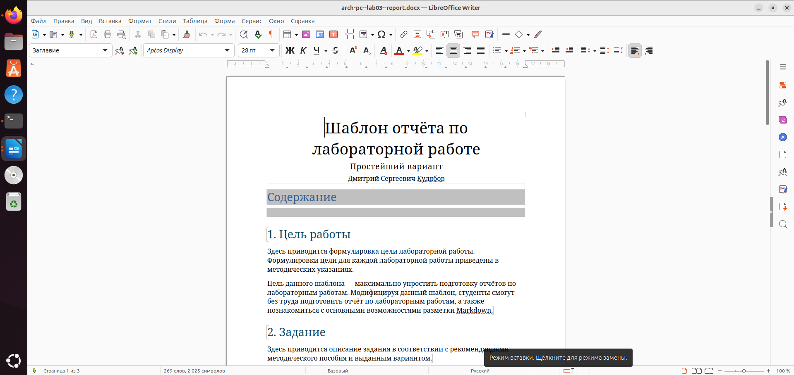{#fig-006 width=70%}

Открыл сгенерированный файл .pdf в LibreOffice ([рис. @fig-007]). Убедился, что всё сгенерировалось правильно.

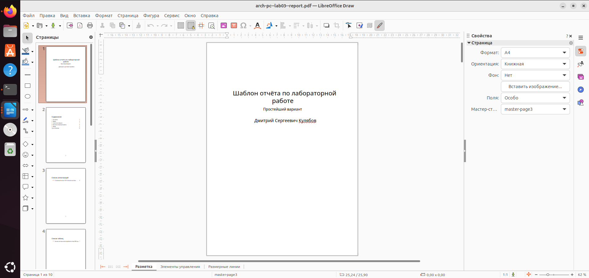{#fig-007 width=70%}

Удалил полученные файлы с использованием Makefile, введя команду make clean ([рис. @fig-008]). С помощью команды ls проверил, удалились ли созданные файлы.

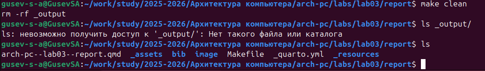{#fig-008 width=70%}

Открыл файл .qmd в LibreOffice ([рис. @fig-009]). Изучил его структуру.

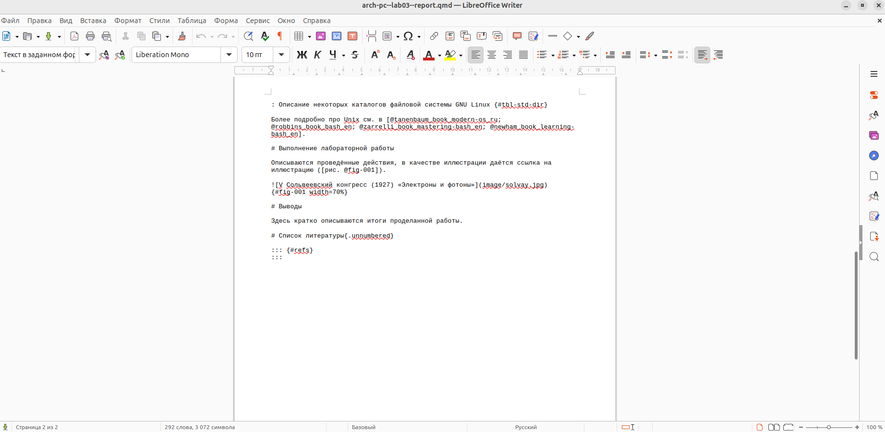{#fig-009 width=70%}

Создал файл report.md, введя команду touch ([рис. @fig-010]). С помощью команды ls проверил, создался ли файл.

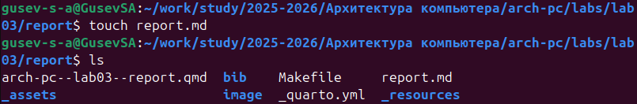{#fig-010 width=70%}

Начал заполнять отчет с помощью языка разметки Markdown в созданном файле ([рис. @fig-011]).

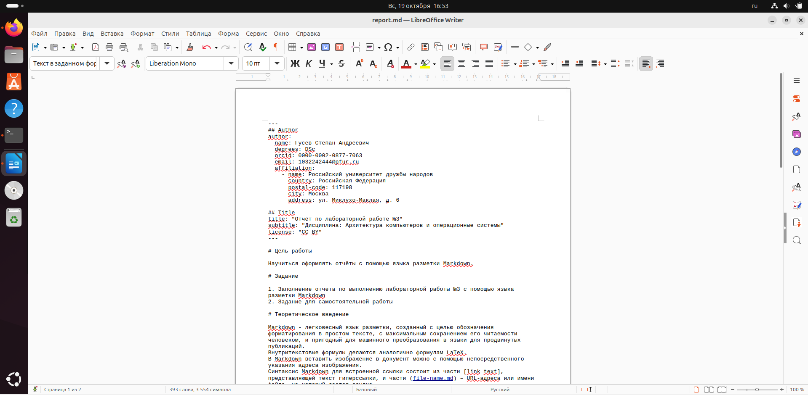{#fig-011 width=70%}

Скомпилировал файлы с отчетом и загрузил их на GitHub.

## Задание для самостоятельной работы

1. Перешёл в директорию lab02/report с помощью cd, чтобы там заполнить отчет по второй лабораторной работе ([рис. @fig-012]).

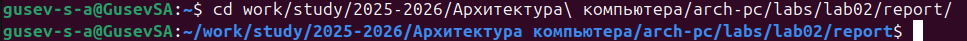{#fig-012 width=70%}

Создал файл Л02_Гусев_отчёт.md для заполнения отчета ([рис. @fig-013]).

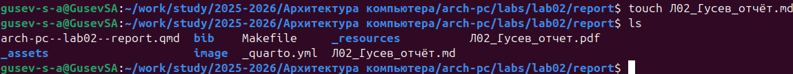{#fig-013 width=70%}

Открыл файл с помощью текстового редактора LibreOffice Writer и начал заполнять отчёт ([рис. @fig-014]).

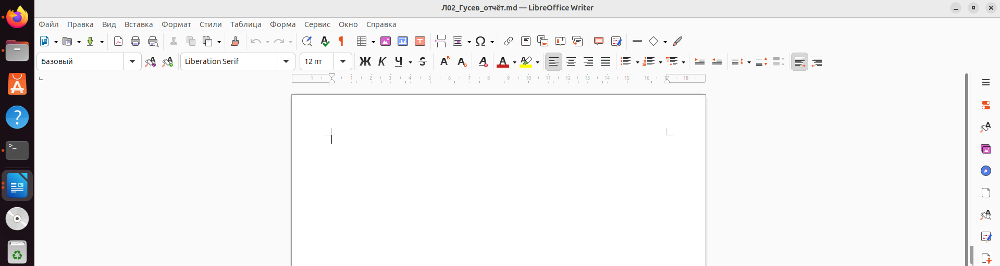{#fig-014 width=70%}

Удалил предыдущий файл отчета, чтобы при компиляции он мне не мешал ([рис. @fig-015]).

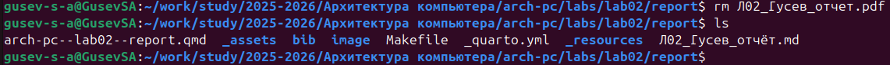{#fig-015 width=70%}

Скомпилировал файл с отчетом по лабораторной работе ([рис. @fig-016]).

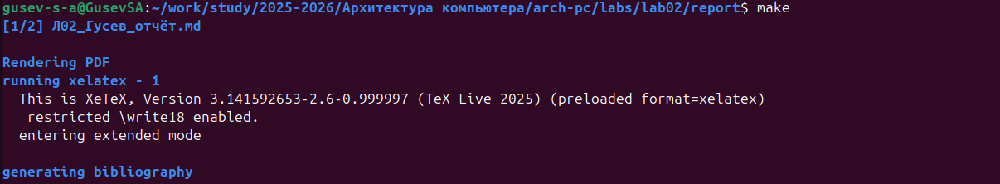{#fig-016 width=70%}

Переместил файлы отчёта и удалил лишние сгенерированные файлы ([рис. @fig-017]).

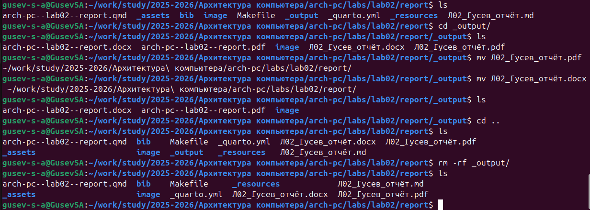{#fig-017 width=70%}

2. Добавил изменения на GitHub командой git add ([рис. @fig-018]).

{#fig-018 width=70%}

Сохранил изменения с помощью commit ([рис. @fig-019]).

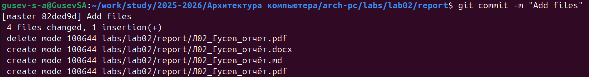{#fig-019 width=70%}

Отправил файлы на сервер с помощью команды git push ([рис. @fig-020]).

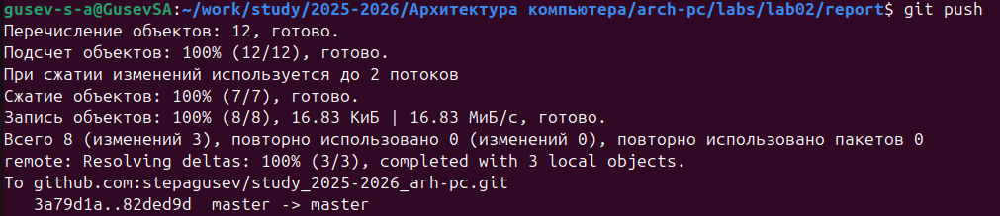{#fig-020 width=70%}

# Выводы

В результате выполнения данной лабораторной работы я познакомился с  процедурами оформления отчетов с помощью легковесного языка разметки Markdown.

# Список литературы

1. [Архитектура ЭВМ](https://esystem.rudn.ru/pluginfile.php/1584625/mod_resource/content/1/%D0%9B%D0%B0%D0%B1%D0%BE%D1%80%D0%B0%D1%82%D0%BE%D1%80%D0%BD%D0%B0%D1%8F%20%D1%80%D0%B0%D0%B1%D0%BE%D1%82%D0%B0%20%E2%84%964.pdf)
